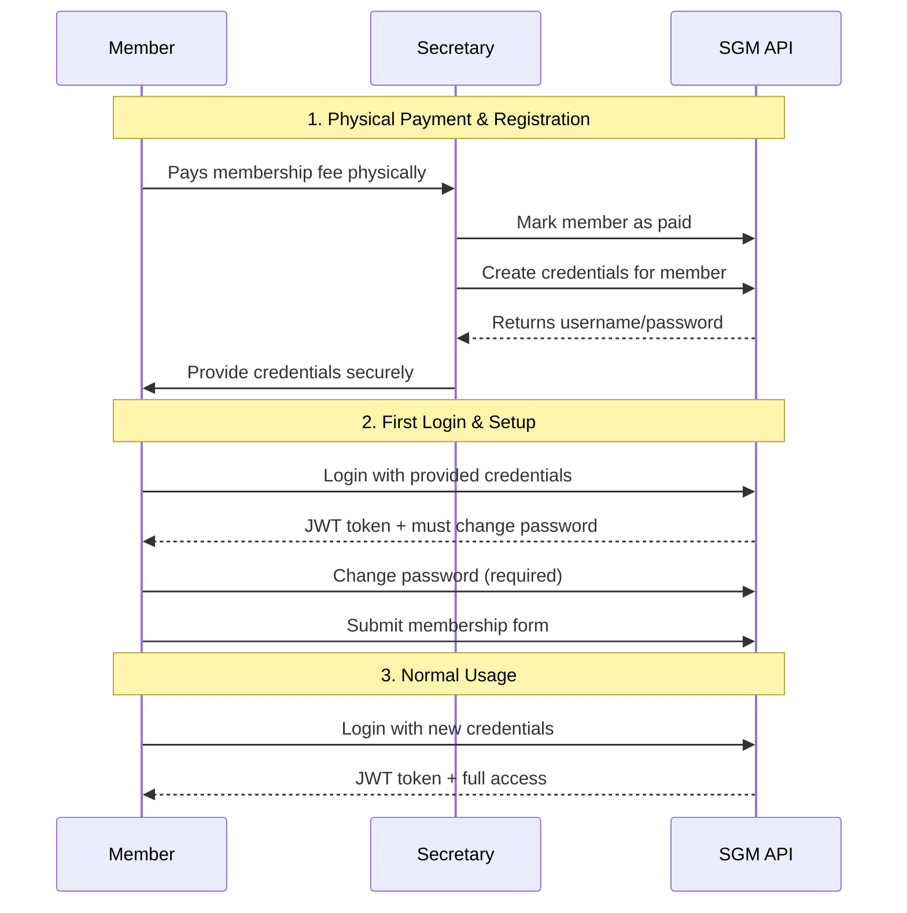

# SGM Backend - Postman API Documentation

This folder contains Postman collections and environments for testing the SGM Backend API with the new local authentication system.

## 📁 Files

### Collections
- **`SGM-Backend-Local-Auth.postman_collection.json`** - Main API collection with all endpoints

### Environments  
- **`SGM-Development.postman_environment.json`** - Development environment (localhost:3000)
- **`SGM-Production.postman_environment.json`** - Production environment template

## 🚀 Quick Start

1. **Import into Postman:**
   - Open Postman
   - Click "Import"
   - Select all files in this folder
   - Choose the appropriate environment (Development/Production)

2. **Authentication Flow:**
   - Run "Login - Secretary" or "Login - President" request
   - JWT token will be automatically saved to `{{authToken}}` variable
   - All authenticated requests will use this token automatically

## 🔐 Test Credentials (Development)

| Role | Username | Password | Description |
|------|----------|----------|-------------|
| Secretary | `marie.secretaire` | `MotPasse123!` | Can manage members, create credentials |
| President | `jean.president` | `MotPasse123!` | Full admin access |

## 📚 API Architecture

### New Local Authentication System (Replaces Clerk)

The API now uses a local JWT-based authentication system instead of Clerk:

1. **Secretary Dashboard** - Manage members who paid but haven't submitted forms
2. **Credential Generation** - Secretary can create username/password for paying members  
3. **Member Login** - Members use generated credentials to access the system
4. **Password Management** - Change passwords, recovery via email
5. **Form Submission** - Members must submit membership forms after first login

### Authentication Flow



## 🗂 API Endpoint Categories

### 🏥 Health Check
- `GET /api/health` - Basic health check
- `GET /api/health/detailed` - Detailed system status
- `GET /api` - API information

### 🔐 Authentication  
- `POST /api/auth/connexion` - User login
- `GET /api/auth/profil` - Get user profile
- `GET /api/auth/statut` - Get authentication status  
- `POST /api/auth/changer-mot-passe` - Change password
- `POST /api/auth/demander-recuperation` - Request password recovery
- `POST /api/auth/reinitialiser-mot-passe` - Reset password with token
- `POST /api/auth/deconnexion` - Logout (logging only)

### 👩‍💼 Secretary Dashboard
- `GET /api/secretaire/tableau-bord` - Dashboard (paid members without forms)
- `POST /api/secretaire/creer-identifiants` - Create credentials for member
- `POST /api/secretaire/marquer-paye` - Mark member as paid
- `GET /api/secretaire/membres` - List all members with filters

### 📝 Membership Applications
- `POST /api/adhesion/soumettre` - Submit membership application
- `GET /api/adhesion/statut` - Get application status (public)
- `GET /api/adhesion/preview-template` - Preview form template (dev)
- `GET /api/adhesion/test-pdf` - Test PDF generation (dev)

## 🧪 Testing Workflows

### 1. Secretary Login & Dashboard
```bash
1. Run "Login - Secretary" 
2. Run "Dashboard - Members who paid but haven't submitted form"
3. Run "List All Members" with different filters
```

### 2. Create Member Credentials
```bash  
1. Login as Secretary
2. Run "Mark Member as Paid" for a member
3. Run "Create Credentials for Member" 
4. Note the generated username/password
```

### 3. Member Registration Flow
```bash
1. Run "Submit Membership Application" (creates new member)
2. Secretary marks as paid
3. Secretary creates credentials
4. Member can now login (test with new credentials)
```

### 4. Password Management
```bash
1. Login with user
2. Run "Change Password" 
3. Test "Request Password Recovery"
4. Test "Reset Password with Token"
```

## 📅 Date Format
This API uses **French date format (DD-MM-YYYY)** for all date fields:
- `date_naissance`: `15-06-1985` (15 juin 1985)
- `date_entree_congo`: `15-01-2020` (15 janvier 2020)  
- `date_emission_piece`: `10-03-2022` (10 mars 2022)

## 🔧 Environment Variables

The environments use these variables:

| Variable | Development | Production | Description |
|----------|-------------|------------|-------------|
| `baseUrl` | `http://localhost:3000` | `https://api.sgm-gabon.org` | API base URL |
| `authToken` | Auto-managed | Auto-managed | JWT authentication token |
| `secretaryUsername` | `marie.secretaire` | *Configure* | Secretary login |
| `secretaryPassword` | `MotPasse123!` | *Configure* | Secretary password |
| `presidentUsername` | `jean.president` | *Configure* | President login |
| `presidentPassword` | `MotPasse123!` | *Configure* | President password |

## 🚨 Important Notes

### Security
- **Never commit production credentials** to version control
- JWT tokens automatically expire after 24 hours
- Rate limiting is enforced (100 requests per 15 minutes)
- Login attempts are limited (10 per 15 minutes)

### Changes from Clerk System
- ❌ No more Clerk signup/signin endpoints  
- ❌ No more external OAuth providers
- ✅ Local JWT-based authentication
- ✅ Secretary-managed credential generation  
- ✅ Built-in password recovery system
- ✅ French language throughout API

### Development Tips
- Set `NODE_ENV=development` to get detailed error messages
- Use the preview endpoints to test PDF generation
- Check server logs for debugging authentication issues
- Database is seeded with test users automatically

## 📞 Support

For API issues or questions:
- Check server logs: `npm run dev` 
- Database issues: `npm run db:studio`
- Reset database: `npm run db:seed`

---

**Version:** Local Authentication System v1.0  
**Last Updated:** August 2025  
**Maintainers:** Elvis Destin OLEMBE, Mondésir NTSOUMOU